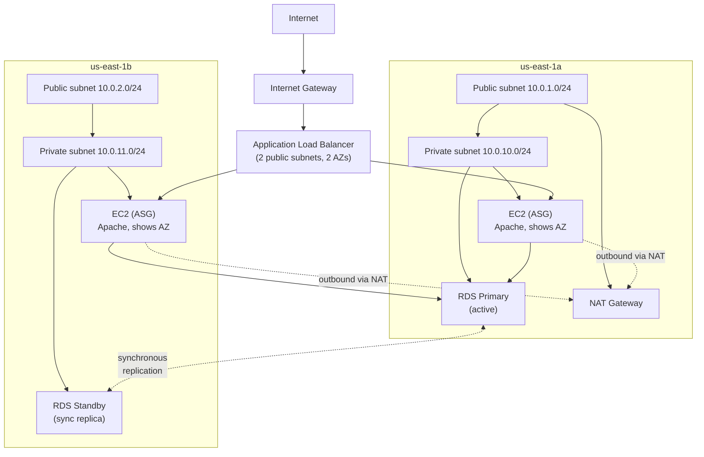

# Architecture

## Multi-AZ HA web application



## Reliability layering

Each tier removes a single point of failure:

| Tier | Component | What survives if it fails |
|---|---|---|
| Edge | ALB across 2 AZs | One AZ goes away; ALB keeps routing to the surviving AZ |
| Compute | ASG min 2 / max 4 across 2 AZs | Instance fails → ASG replaces; AZ fails → ASG keeps healthy AZ at desired capacity |
| Data | RDS Multi-AZ (sync standby) | Primary fails → AWS promotes standby in ~60-120s, same DNS endpoint |
| Egress | NAT Gateway (single AZ) | **NOT redundant** — see "Production considerations" |

## What's intentionally non-production

A lab balances completeness with cost. Things that would change in production:

- **NAT Gateway in only one AZ** (~$32/mo savings; production needs one per AZ)
- **db.t3.micro RDS** (production uses a larger instance class with proper IOPS)
- **No CloudFront in front of ALB** (production needs CDN + DDoS protection)
- **No WAF** (production needs OWASP rule sets, especially for healthcare workloads)
- **Apache user-data instead of an AMI** (production uses Packer-baked images or proper config management)
- **No autoscaling policies** (production needs target tracking on CPU/request rate)

These are deliberate omissions for the lab. They're documented so an interviewer reviewing the code can see they're intentional choices, not gaps.

## ALB Apache instance identifier trick

Each EC2 runs a one-line Apache page that displays its AZ:

```html
Instance in AZ: us-east-1a
```

Refreshing the public ALB DNS rotates between AZs visibly, proving load balancing is happening. This makes the demo concrete: "the page just changed from `us-east-1a` to `us-east-1b` — that's the ALB rotating between AZs."

## Why this lab is archived

The portfolio centers on **network engineering** — BGP, IPSec, VPC topology, observability. `ha-web-app` is **application architecture**, which would belong in an AWS Solutions Architect portfolio. It stays in this repo as a reference any reviewer can verify against the Terraform code, but it isn't pinned on the GitHub profile.
